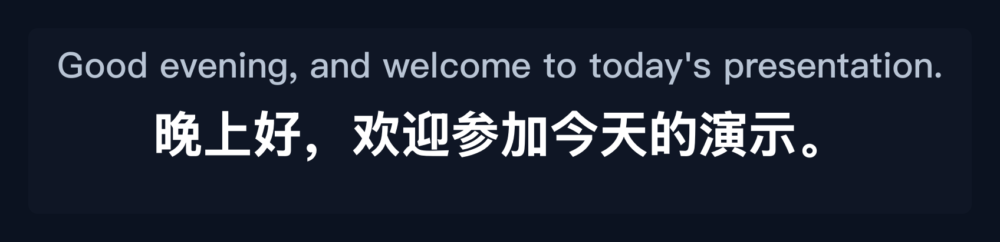
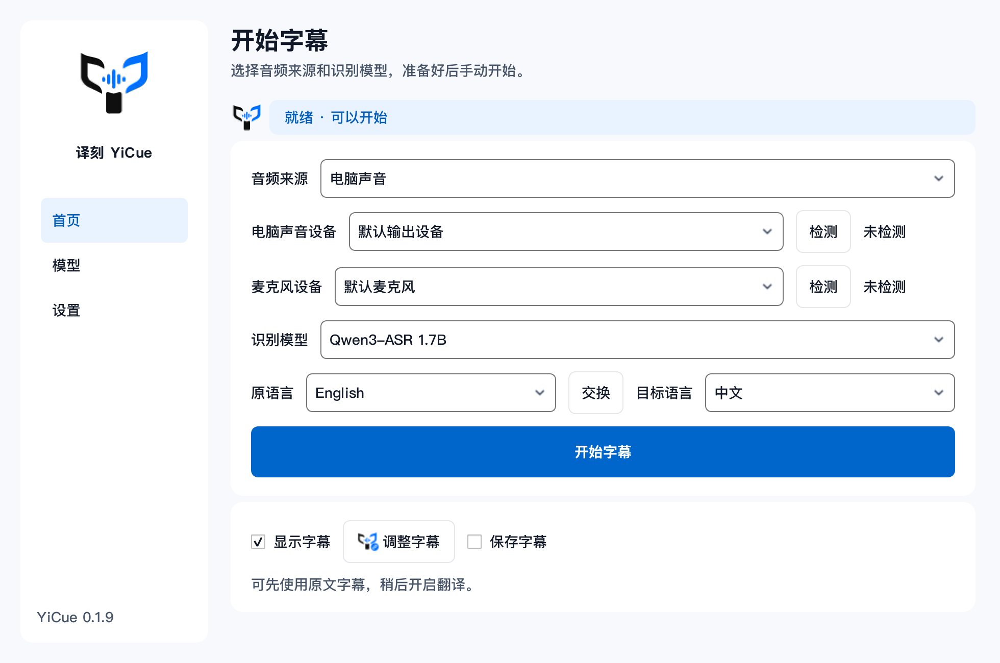
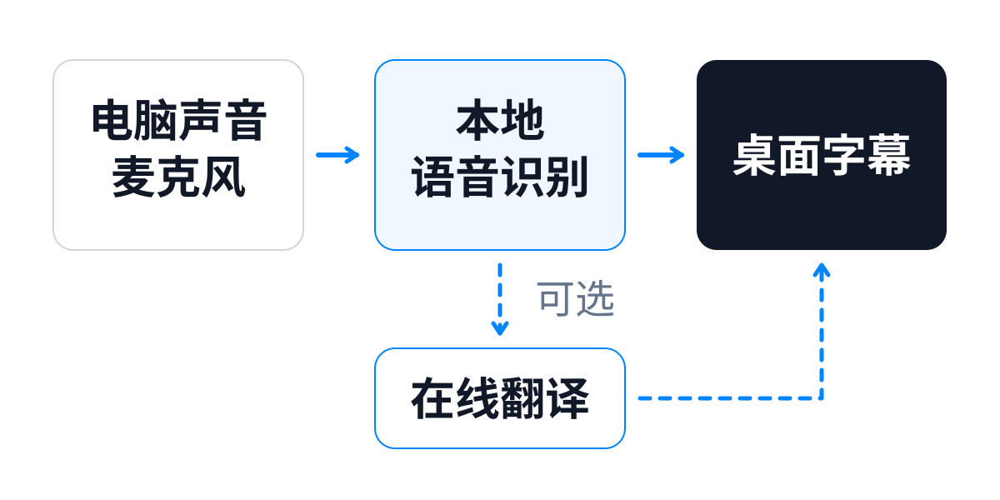

  

<h1 align="center">译刻 YiCue</h1>

<strong>把正在听的声音，变成看得见的字幕。</strong>

Windows 实时语音字幕 · 本地识别 · 可选翻译 · 桌面悬浮窗

  <a href="#下载与安装">下载与安装</a> ·
  <a href="#开始使用">开始使用</a> ·
  <a href="#模型选择">模型选择</a> ·
  <a href="#许可与反馈">许可与反馈</a>

YiCue 是一款 Windows 桌面应用：捕获电脑声音、麦克风或混合音频，在本机完成语音识别，将原文和可选译文显示在其他窗口上方。看视频、追直播、玩游戏或参加线上交流时，都可以使用同一套字幕流程。

  

> 界面截图由当前 0.1.9 源码渲染。示例字幕用于展示布局；实际识别与翻译结果取决于音频、模型和服务。

## 下载与安装

**当前产品版本：0.1.9 · Windows x64**

### [Windows 安装包下载入口（公开发布准备中）](https://github.com/drydraft/YiCue-Releases/releases/latest)

公开下载入口将在独立的 `YiCue-Releases` 仓库发布后启用。下载时选择 Release 的 **Assets** 中的 `YiCue-版本号-Setup.exe`。

安装包包含运行环境。安装后直接启动应用，在应用内下载识别模型即可使用。模型文件需单独下载，翻译服务按需配置。

1. 运行安装包，按当前 Windows 用户安装。
2. 打开 YiCue，选择下载区域、识别模型和模型目录。
3. 等待模型下载并校验完成，检查音频来源，然后开始字幕。

## 开始使用

  

### ① 选择要听的声音

- **电脑声音**：识别当前输出设备播放的内容。
- **麦克风**：识别所选麦克风的讲话。
- **混合音频**：把电脑声音与麦克风混合，生成同一路字幕。

设备旁的“检测”按钮可以检查是否有声音输入。

### ② 选择语言，开始字幕

原语言可以自动识别，也可以指定中文、英语、日语或韩语。选择目标语言后点击“开始字幕”；需要暂时停下时点击“暂停字幕”。

### ③ 按需开启翻译

在设置中填写自己的翻译服务地址、模型名和 API Key。服务使用 OpenAI 兼容接口；可选流式输出、上下文轮数、场景提示词和超时设置。

只使用原文字幕时，可以跳过翻译配置。原语言与目标语言一致时跳过翻译；翻译失败时原文识别继续运行。第三方翻译服务的费用和额度由服务提供方决定。

### ④ 调整到舒服的位置

点击“调整字幕”可以拖动和拉伸字幕窗。字体、原文／译文颜色、背景、透明度和显示方式可以在设置中调整；正常显示时可开启点击穿透。

| 快捷键 | 操作 |
| --- | --- |
| `Ctrl + Alt + S` | 开始／暂停字幕 |
| `Ctrl + Alt + H` | 显示／隐藏字幕 |

关闭主窗口后可从托盘重新打开；退出应用请使用托盘菜单中的“退出”。

## 模型选择

首次引导会根据本机内存推荐模型，你也可以自行选择。当前模型文件大小如下，实际运行还需要额外的内存和磁盘空间。

| 模型 | 大小约 | 区域 |
| --- | --- | --- |
| **Qwen3-ASR 1.7B** | 2.19 GB | 国内／海外 |
| **Qwen3-ASR 0.6B** | 0.85 GB | 海外 |
| **SenseVoice Small** | 0.94 GB | 国内／海外 |
| **Whisper Base** | 0.15 GB | 海外 |

Qwen3-ASR 使用 GGUF 模型，自动选择可用的原生后端。SenseVoice Small 在 CPU 上运行；Whisper Base 使用 CPU / int8。

模型可以下载、暂停、继续和删除。下载按固定版本检查文件大小与 SHA-256，加载前再次校验；更换模型目录会切换保存位置，已有文件需自行安排。

## 日常使用能力

- **原文先显示，译文随后补充**：慢翻译不会阻塞窗口，也不会覆盖更新的字幕。
- **可选临时字幕**：在讲话过程中预览识别结果，最终结果再替换预览。
- **悬浮字幕与音量反馈**：原文、译文和音量指示分别显示，窗口位置与尺寸可保存。
- **后台运行**：托盘控制、开机启动、默认单实例；设置中可以选择多实例。
- **本机字幕记录**：默认关闭，开启后保存最终原文和译文，缺少译文时保留未完成状态。

## 工作方式与数据

  

界面、音频处理和模型推理分层运行。Engine 负责采集、混音、语音检测和任务调度，独立 Worker 加载当前模型；Qwen 使用应用内置的 Node 推理适配器。队列有容量和过期限制，优先保持实时性。

- **语音识别在本机执行**；模型下载需要联网。
- **启用翻译后**，识别文字及配置的上下文会发送给你选择的翻译服务。服务凭据和数据使用规则以该服务为准。
- **字幕记录由你选择开启**，临时字幕不写入记录。记录是分段事件流，适合回看字幕。
- **API Key 使用 Windows 用户级加密保存**，普通设置与凭据分开存储。

默认用户数据位于 `%LOCALAPPDATA%\YiCue`，模型与字幕记录目录可自行选择。卸载默认保留个人数据。

## 使用前了解

- 当前提供 Windows x64 安装包；识别速度、准确率和延迟受模型、硬件、噪声与音频设备影响。
- 混合音频共用一路识别，不区分讲话人。
- 持续讲话或处理跟不上时，实时队列可能丢弃过旧片段；字幕记录不承诺完整逐字稿。
- 当前更新通过下载新安装包完成；应用内更新入口尚在准备。
- 下载失败时可以重新尝试；切换下载区域前请查看模型是否支持该区域。

## 许可与反馈

YiCue 以专有软件形式提供，源码在私有开发仓库维护。软件许可见 [EULA 审阅草案](EULA.md)，第三方组件及模型保留各自的许可，详见 [第三方声明](THIRD_PARTY_NOTICES.md)。公开发行前将确认对应版本的正式许可条款。

遇到问题时，请提供应用版本、Windows 版本、所选模型、音频来源和复现步骤。设置中的“系统日志 → 打开日志目录”可以找到运行日志；分享前请检查并移除敏感内容。

问题反馈与使用建议请提交到 [YiCue-Releases Issues](https://github.com/drydraft/YiCue-Releases/issues)。
